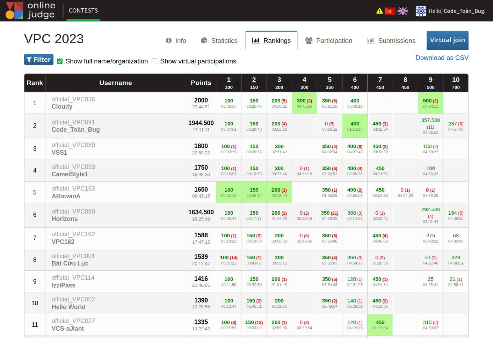

Viettel Programming Contest 2023
----

## Một số link

- [Đề thi](resources/VPC2023.pdf)
- [Bảng ranking cuối cùng](resources/ranking_final.csv)
- [Bảng ranking trước đóng băng](resources/ranking_before_freeze.csv)
- [Code đáp án bằng C++ (không giải thích)](resources/Đáp%20án%20VPC%202023_C++_Judge.pdf)
- [Toàn bộ input/output các bài](resources/TestcasesVPC2023.zip)
- [Link cuộc thi (có thể bị xoá bất kì lúc nào)](https://vpc.vnoi.info/contest/vpc)
- [Lời giải & Bình luận ở VPC 2023 Practice Session](https://github.com/thucdx/vcc23_practice_session)

## Final Ranking

(Team của tác giả bài viết này tên là *Code_Toàn_Bug*)

## Các bài toán và lời giải

### A. Sắp xếp chỗ ngồi
Bài này đơn thuần là duyệt.

[View source (Java)](src/A_XepChoNgoi.java)

### B. Vận chuyển gạo

Sắp xếp vị trí của Nhà, và vị trí Kho gạo theo thứ tự tăng dần, rồi khi tới từng vị trí thì làm theo mô tả của đề bài.

[View source B_VanChuyenGao (Java)](src/B_VanChuyenGao.java)

### C. Khảo sát dân cư

Bài này cần sắp xếp theo thứ tự giảm dần của `f_i = c_i / p_i`.
Sau đó lấy lần lượt từ trên xuống dưới dừng lại khi `f_i > f_(i-1)`.
Bài sẽ hay hơn nếu yêu cầu in ra `k` lớn nhất, thay vì bất kì `k` nào.

[View source C_KhaoSatDanCu (Java)](src/C_KhaoSatDanCu.java)

### D. Kết nối

Đây là bài toán cây khung con nhỏ nhất, kết hợp với chiến lược tham lam để đặt các trạm phát sóng wifi trên cây khung này.

Kết quả cần trả ra là giá trị nhỏ nhất trong 2 trường hợp sau:
- Cost của việc nối cây khung cho n đỉnh, sử dụng hoàn toàn bằng cáp quang.
- Cost của việc dùng mix giữa trạm phát sóng và cáp quang. Cost này được tính bằng cách thay thế dần các đường cáp quang bằng trạm phát sóng wifi.

Chi tiết xem trong code:

[View source D_KetNoi (Java)](src/D_KetNoi.java)

### E. Nối vòng tay lớn

Bài này nếu chạy mô phỏng theo đúng yêu cầu đề bài sẽ bị quá thời gian (TLE). Do vậy cần tìm cách giảm `p` xuóng 1 giá trị `p'` rồi mới thực hiện mô phỏng.
Để làm được việc này,
- Trước tiên cần tìm minP - giá trị nhỏ nhất của p để trò chơi có thể diễn ra ít nhất tròn 1 vòng.
- Với những giá trị p < minP thì có thể chạy simulate luôn.
- Với giá trị p > minP, thì tìm cách chuyển `p` -> `p'` với `p'` là giá trị nhỏ nhất >= minP mà sau thực hiện 1 số vòng thì p thành p`. Để xác định việc này ta nhìn sự thay đổi của x (x >= minP) sau mỗi vòng.

[View source E_NoiVongTayLon (Java)](src/E_NoiVongTayLon.java)

### F. Tách xâu
Bài này cần tìm cách tách sâu `s` thành các từ cho trước trong từ điển.
Để làm việc này ta sử dụng quy hoạch động cộng với lưu vết.

- `bool[] isOK`, với isOK[i] là khả năng để xâu s[0...i] (bao gồm cả `i`) có thể tách thành các từ trong từ điển. Kết quả cần tìm là `isOK[l-1]` với `l` là độ dài xâu `s`.
- `int[] start`, xâu s bắt đầu từ `start[i]` tới vị trí `i` (bao gồm cả `i`) có trong từ điển, và `isOK[i-1] = true`

[View source F_TachXau (Java)](src/F_TachXau.java)

### G. Phủ sóng internet
Bài này trước cần giải bài toán 1D sẽ dễ hình dung, sau đó bài toán 2D chỉ đơn giản là giải 2 bài 1D và lấy tích nhân với nhau.

Xét bài toán 1D: Trên đoạn thẳng `[1, n]`, có nhiều đoạn `seg_i = (l_i, r_i) (l_i <= r_i)` phủ từ l_i tới r_i. Hỏi có bao nhiêu vị trí i trong [1,n] không bị phủ?

Để giải bài toán này, ta sắp xếp `seg` theo thứ tự tăng dần của `l_i`, với `l_i` bằng nhau, thì ưu tiên `r_i` nhỏ trước.
Sau đó duyệt từ trái qua và đếm số vị trí không được phủ (bản chất là `max(0, l_i - max_r_so_far - 1)`)

- Bài toán 2D: số ô trống (không được phủ) bản chất là tích của 2 kết quả tính theo trục x và trục y.
- Kết quả cuối cùng là: `số vị trí được phủ = n*m - số ô trống`.

[View source G_PhuSongInternet](src/G_PhuSongInternet.java)

### H. Sắp xếp kho hàng
Bài H yêu cầu thay đổi tăng giảm các phần tử trong mảng `arr` để biến `arr` thành dãy không giảm.
Cần tìm tổng sự tăng giảm `C` là nhỏ nhất.

Ví dụ: 
Dãy
 `1 4 2 5 2` => biến thành `1 2 2 4 4` cần: `C = |4 - 2| + |5 - 4| + |2 - 4| = 5` sự tăng giảm. Đây cũng tổng tăng giảm nhỏ nhất.

Để làm bài này cần có 1 nhận xét:
- Trong tất cả các cách thay đổi thoả mãn S nhỏ nhất, tồn tại 1 cách thay đổi mà dãy *không giảm* thu được *chỉ gồm các phần tử của dãy ban đầu* (có thể không chứa toàn bộ phần tử của dãy ban đầu).
Có thể chứng minh (bạn đọc tự suy nghĩ :-) ) hoặc thử 1 vài trường hợp với n = 2, 3 để nhận thấy điều này. Ví dụ bên trên dãy thu được chỉ gồm 1,2,4 đều thuộc dãy gốc ban đầu.

Với nhận xét này, ta sẽ sử dụng quy hoạch động như sau:
- Xét dãy `s` là dãy `arr` đã được sắp xếp.
- Tạo mảng `dp[][]` (`n x n` phần tử) trong đó dp[i][j] là tổng sự tăng/giảm nhỏ nhất để biến đổi dãy `arr[0...i]` (bao gồm cả `i`) mà arr_after[i] <= s[j].
- Công thức quy hoạch động: `dp[i][j] = min(dp[i][j-1], dp[i-1][j] + abs(a[i] - s[j]))`.
Chú thích: 
    + dp[i][j-1] tương đương biến đổi a[0..i] thành dãy không giảm mà `arr_after[i] <= vs[j-1]`.
    + dp[i-1][j] + abs(a[i] - s[j]) tương đương biến biến arr[i-1] thành <= s[j] và a[i] thành s[j]
    

  [View source H_SapXepKhoHang (java)](src/H_SapXepKhoHang.java)

### I. Hỗ trợ khách hàng
Bài này cần tìm cách sắp xếp khách hàng tương ứng với kỹ thuật viên, để đảm bảo quãng đường đi xa nhất là nhỏ nhất.

Để làm bài này có 1 số bước như sau:
- Tính toán tất cả các cặp khoảng cách `(customer_i, technician_j)` với mọi `i, j` trong [1, k]. Để làm điều này, sử dụng thuật toán `Floyd-Warshall` để tìm khoảng cách ngắn nhất của tất cả cặp đỉnh.
- Bài toán trở thành: có 2 tập `C` và `T`, mỗi tập `k` phần tử, tìm số `minDist` nhỏ nhất để tồn tại cách ghép k cặp `(u, v)` với `u` thuộc `C`, `v` thuộc `T` mà `d(u,v)` <= `minDist`
- Để tìm `minDist` ta sẽ sử dụng Binary Search.
- Với mỗi `minDist` ta sẽ có 1 số lượng tập cạnh nhất định (lấy tất cả các cạnh nối giữa C và T mà cạnh đó khoảng cách <= minDist), cần kiểm tra xem tồn tại cách ghép đủ k cặp cạnh nối giữa C và T không?
Đây là một trường hợp của bài toán `Cặp ghép cực đại` (`Maximum Bipartite Matching`). Có nhiều thuật toán khác nhau để giải, trong lời giải dưới đây sử dụng `Kuhn's algorithm`. Các code mẫu của các thuật toán khác nhau có thể tham khảo ở đây: [Cặp ghép cực đại trên đồ thị hai phía
  ](https://oj.vnoi.info/problem/nkbm)

[View source I_HoTroKhachHang (Java)](src/I_HoTroKhachHang.java)

### J. Robôt thông minh
(*4.2/10*)

Bài này có 1 cách là sinh ngẫu nhiên các chỉ thị rồi chọn ra chỉ thị tốt nhất.
Một số cách tốt hơn có thể cân nhắc sử dụng quy hoạch động, đệ quy nhánh cận, tham lam, vân vân.

[View source J_RobotThongMinh (Java)](src/J_RobotThongMinh.java)

----
*Happy Coding!*

ThucDX

